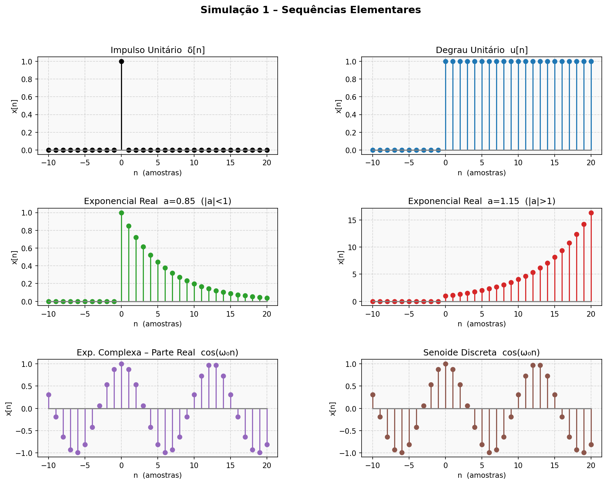
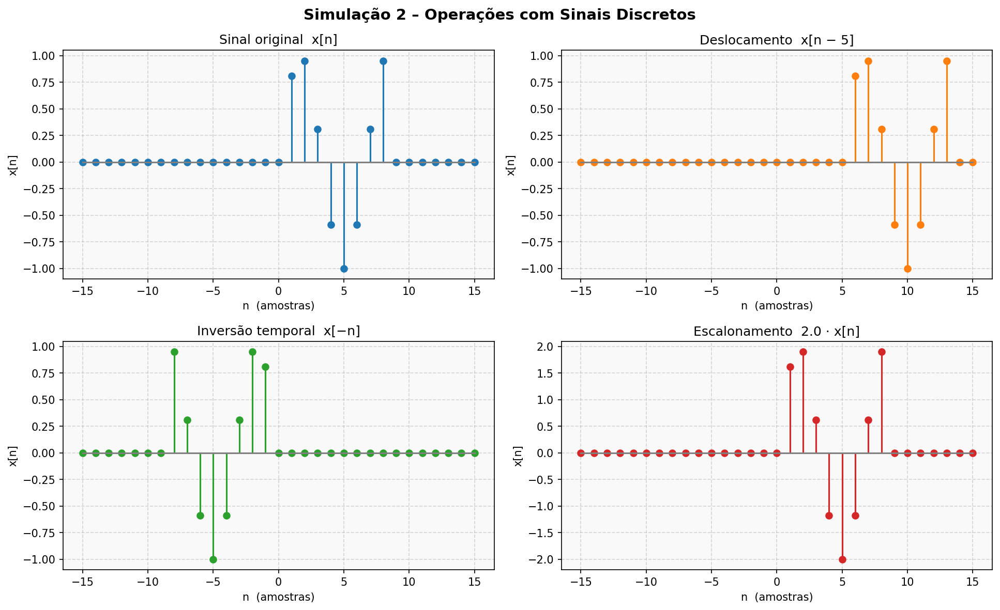
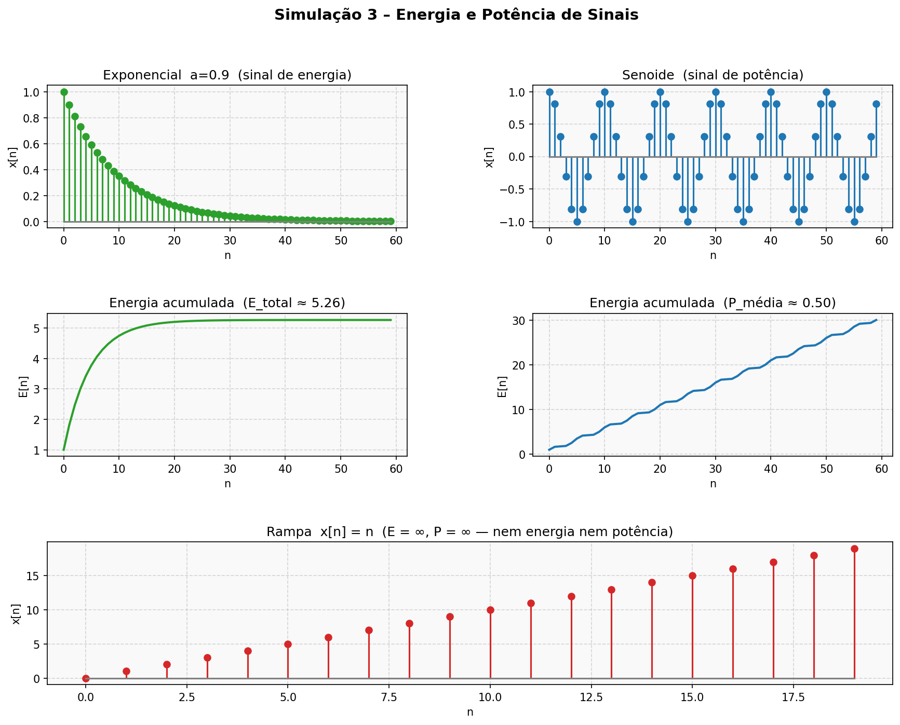
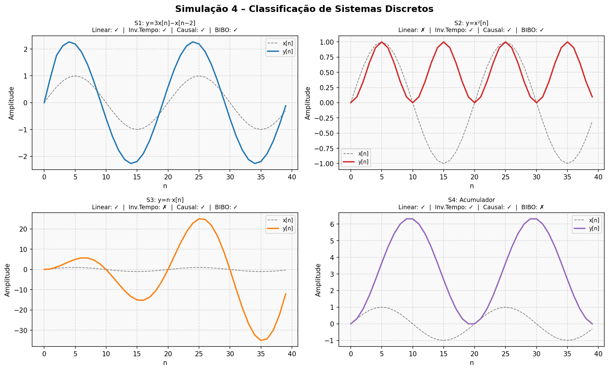
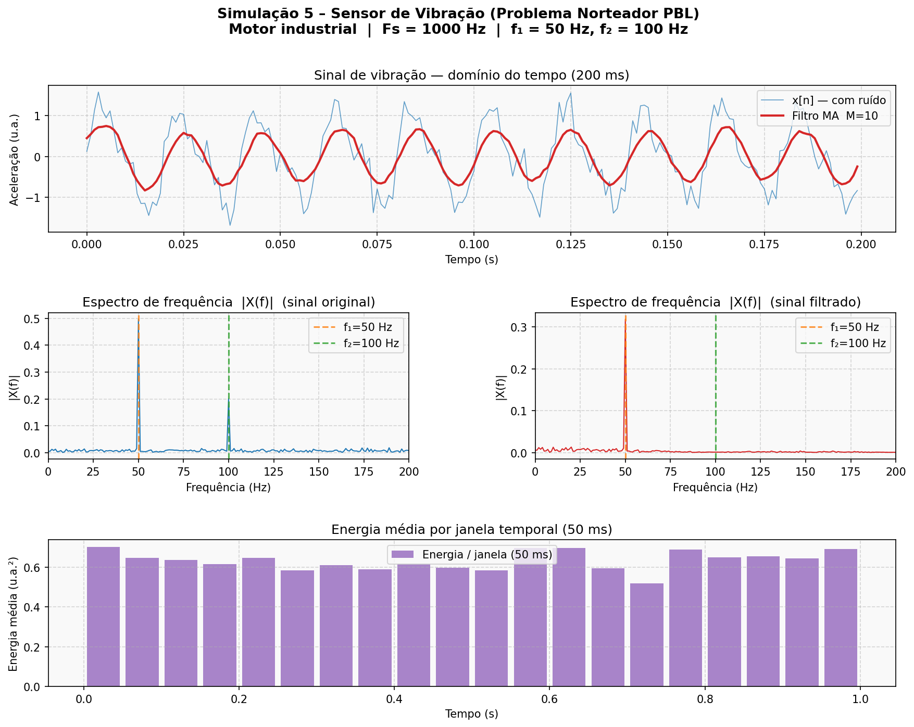

# PDS – Estudo Dirigido | Parte 1
## Modelagem de Sinais e Sistemas Discretos

**Disciplina:** Processamento Digital de Sinais  
**Curso:** Engenharia da Computação
**Instituição:** Instituto Federal da Paraíba (IFPB)  

---

## Problema Norteador (PBL)

> *Como representar matematicamente o comportamento temporal de um sensor real e quais propriedades estruturais devem ser analisadas para garantir o correto processamento digital desse sinal?*

**Resposta resumida:** O sinal do sensor é modelado como sequência discreta `x[n] = x_a(n/Fs)`, obtida por amostragem respeitando `Fs ≥ 2·Fmax` (Teorema de Nyquist-Shannon). Para processamento correto, o sistema digital deve ser **LTI, causal e BIBO-estável** — propriedades verificadas analítica e numericamente nesta etapa, com aplicação direta no filtro de média móvel da Simulação 5.

---

## Estrutura do Repositório

```
pds_estudo_dirigido/
├── README.md
├── teoria/
│   └── resumo_teorico.md          # Fundamentação teórica completa (7 seções)
├── simulacoes/
│   ├── simulacoes_pds.py          # Simulações feitas em Python (código comentado)
│   └── discussao_tecnica.md       # Análise e interpretação dos resultados
└── resultados/
    ├── sim1_sequencias_elementares.png
    ├── sim2_operacoes_sinais.png
    ├── sim3_energia_potencia.png
    ├── sim4_classificacao_sistemas.png
    └── sim5_sensor_vibracao.png
```

---

## Conteúdos Abordados

- Sinais contínuos e discretos; processo de amostragem; Teorema de Nyquist-Shannon
- Sequências elementares: impulso δ[n], degrau u[n], exponenciais real e complexa, senoide
- Operações com sinais: deslocamento, inversão temporal, escalonamento
- Energia e potência: classificação de sinais, energia acumulada
- Classificação de sistemas: linearidade, invariância no tempo, causalidade, estabilidade BIBO, invertibilidade
- Aplicação em sensor de vibração industrial (Problema PBL)

---

## Simulações Desenvolvidas

| # | Título | Conteúdo |
|---|--------|----------|
| 1 | Sequências Elementares | δ[n], u[n], exponenciais real e complexa, senoide discreta |
| 2 | Operações com Sinais | Deslocamento, inversão temporal, escalonamento de amplitude |
| 3 | Energia e Potência | Classificação, energia acumulada, sinal de energia vs. potência |
| 4 | Classificação de Sistemas | Verificação numérica de linearidade, invariância, causalidade, BIBO |
| 5 | Sensor de Vibração (PBL) | Sinal real, FFT, filtro de média móvel, energia por janela |

---

## Como Executar

```bash
# Requisitos
pip install numpy matplotlib

# Execução
python simulacoes/simulacoes_pds.py
```

---

## Resultados

### Simulação 1 – Sequências Elementares


### Simulação 2 – Operações com Sinais


### Simulação 3 – Energia e Potência


### Simulação 4 – Classificação de Sistemas


### Simulação 5 – Sensor de Vibração (PBL)


---

## Referências

- OPPENHEIM, A. V.; SCHAFER, R. W. *Discrete-Time Signal Processing*. 3. ed. Pearson, 2010.
- PROAKIS, J. G.; MANOLAKIS, D. G. *Digital Signal Processing: Principles, Algorithms and Applications*. 4. ed. Pearson, 2006.
- LATHI, B. P. *Signal Processing and Linear Systems*. Oxford University Press, 1998.